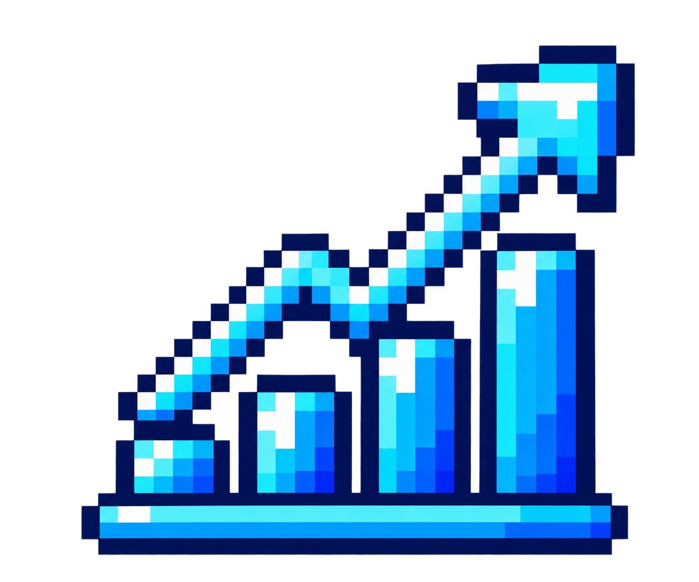
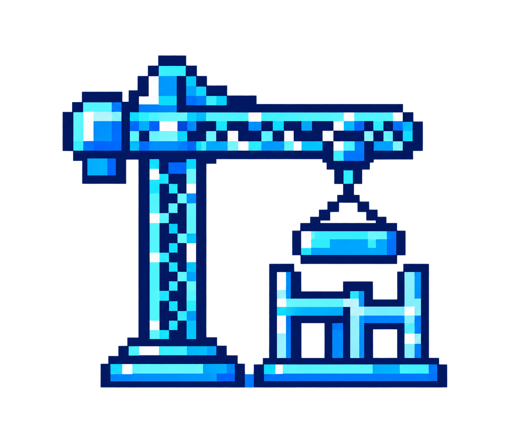
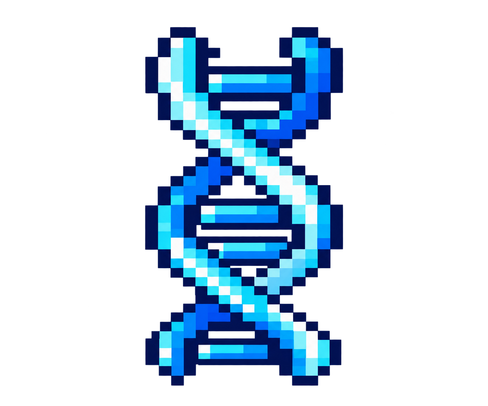

##   Creamos tecnología desde Latinoamérica para Latinoamérica

En Buk construimos tecnología pensada para los desafíos reales de nuestra región. Queremos que las empresas puedan dedicar más tiempo a lo que realmente importa: las personas.

#### ▶️  [💙 Conoce Buk por dentro](https://drive.google.com/file/d/1gRVTLFDlrKsMJ-yp8y2YFisZzm3OP3pO/view)

###   Somos dueños de lo que construimos

Nuestros equipos tienen autonomía para tomar decisiones y hacerse cargo de todo el ciclo de lo que construyen: desde diseñar y desarrollar una solución hasta verla funcionando en producción.

Construimos pensando en calidad, productividad y escalabilidad, con la libertad de decidir cómo abordar cada desafío.

#### ▶️  [Conoce cómo construimos producto en Buk](https://drive.google.com/file/d/1IslY7l2t6zdo_00n96kRE6CNMfuzGhHE/view)

  ###  Construimos para una escala real

Hoy nuestra tecnología impacta a más de 2 millones de usuarios en Latinoamérica, lo que nos desafía constantemente a construir soluciones sólidas y preparadas para crecer.

###  La IA es parte de cómo trabajamos

La IA no es algo que estamos esperando para el futuro: ya forma parte de nuestro día a día en Engineering.

La integramos en nuestros flujos de trabajo para potenciar tareas como code reviews, refactorización y despliegues, buscando construir mejor y movernos más rápido.

###  Equipos pequeños, grandes desafíos

Trabajamos en tribus y equipos con autonomía para tomar decisiones, proponer soluciones y hacerse responsables de su impacto.

Buscamos que cada equipo pueda entender el problema, decidir cómo resolverlo y llevar esa solución hasta producción.

###  Juntos hacemos Buk  

Detrás de todo lo que construimos hay equipos que comparten desafíos, aprenden constantemente y buscan elevar la forma en que hacemos tecnología.

Porque Buk no se construye solo desde el código, sino también desde las personas que están detrás de él.

#### ▶️  [Conoce el ADN de Buk](https://drive.google.com/file/d/1GZVahRpCDrBgXnSh_nRLnrP94P-5PO1R/view)

*Siguiente paso:* 👉 **[Explora nuestro Pilar 2: Evidencia (Arquitectura, escala y prácticas reales)](https://github.com/Javipizarrot/arquitectura_escala_practicas_reales.git)**

---

